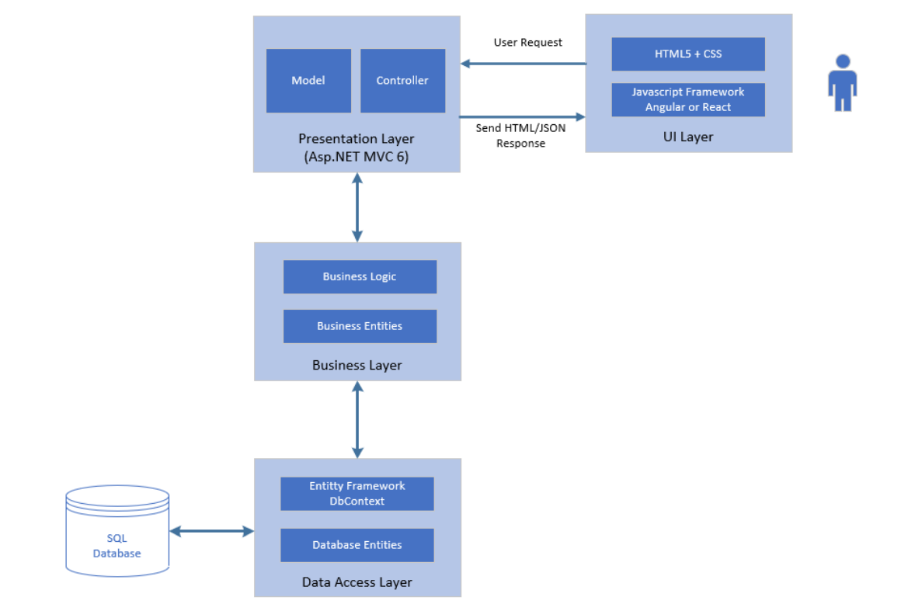

# Grocery Store - Angular & ASP.NET MVC

Welcome to the Grocery Store web application, a seamless shopping experience powered by Angular for the front end and ASP.NET Core for the back end. This project incorporates various features and technologies to provide users with a user-friendly and efficient platform.

## Technologies Used
### Front-End (Angular)
* **Angular Framework**: The project is built using Angular, a popular JavaScript framework for building scalable web applications.
* **Routing**: Angular's built-in routing module is used to handle navigation between different pages of the grocery store application.
* **Reactive Forms**: Angular's reactive forms approach is utilized for form handling and validation, providing a dynamic and interactive user interface.
* **ngBootstrap**: The application leverages the ngBootstrap library to enhance the UI with pre-styled and responsive components.
* **Angular FontAwesome**: FontAwesome icons are incorporated into the application using the Angular FontAwesome package, giving a visually appealing look.
* **RxJS**: Reactive Extensions for JavaScript (RxJS) is employed to handle asynchronous operations and manage data streams within the application.

### Back-End (ASP.NET Core)
* **ASP.NET MVC**: The back-end of the grocery store application is developed using the ASP.NET MVC framework, providing a robust and scalable server-side infrastructure.
* **JWT Token Authentication**: The application uses JWT (JSON Web Token) authentication to secure the APIs and ensure authorized access to protected resources.
* **Role Based Authorization**: Implemented and used role based authorization to authorize user before requesting the api to perform any action.
* **Fluent Validation API**: Fluent Validation API is employed for model validation, allowing for easy and customizable validation rules for the data submitted by users.

### DataBase (SQL Server)
The grocery store project utilizes SQL Server as the database management system to store and manage data related to products, orders, users, and other relevant information. SQL Server is a powerful and widely used relational database management system (RDBMS) that provides robust data storage, transactional capabilities, and efficient data retrieval.

#### Data Structures and Tables
* **Products** : Stores information about the grocery store products, such as name, description, price, and stock availability, discount etc.
* **Orders**: Stores information about orders such as product Id, user Id, quantity bought, buying price etc.
* **Users**: Stores information about individual users, like user Id, user Name, email, password, phone number, role etc.

There are other tables like Roles, Reviews, ProductCategories, Categories, Cart that stores the eseential information for proper functionality of the web app.

## Functionalities
The webApp provides Route guards and role based access to different parts of the application. 
* In Angular I have used Route Guards to Allow only authorized users to access a page.
* In .NET CORE Web Api I used Authorization filters to add funciontality of Authorization on api for a particular type of users
### There are 3 kinds of Roles:
1. superAdmin
2. admin
3. user\
    a. loged in \
    b. anonymous\
Here is the siteMap of the web app

### Role Based Access:

#### Anonymous user has access to:

- Dashboard
- Product page
- Login
- Register

#### Logged in user has access to:

- Dashboard
- Product page
- Add to cart
- Add Reviews
- Delete own reviews
- Cart
- My Orders
- Place order
- Sign out

#### Admin has access to:

- Dashboard
- Add product
- Product page
- Delete Product
- Edit Product
- Add reviews
- Delete any review
- Top 5 most ordered products in a month
- Sign out

#### SuperAdmin has access to:

- Everything access that the Admin has
- Add new Admin
- Remove admin access of an admin.
